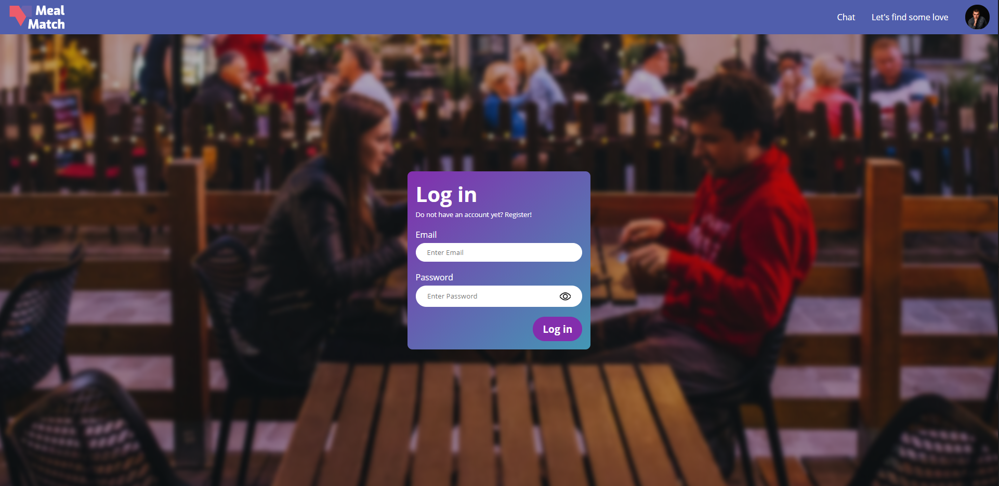

# projectTechGroup dating app

## 📚 Table of contents

- [About](#-about)
  - [Build with](#-build-with)
- [Installing the project](#-installing-the-project)
  - [Setup database](#-setting-up-the-database)
  - [Launch the project](#-launching-the-project)
  - [Linting the project](#-linting-the-project)
- [Team](#-team)
- [Sources](#-sources)

## 🤔 About

Hi there! Welcome to our repository, featuring our datingapp.



In this repository you will find a datingapp containing the following features:

- Register/login
- Liking, disliking and megaliking other people
- Chatting with your matches (and seding gifs)
- A fill in form for after the date

The webapp is ment for people who are looking to get into some more serious dating focussing on dinner dates. It is just like [First Dates](https://www.npo3.nl/first-dates/BNN_101378960), with the only difference that you have to do the organizing yourself. You are able to find people with the same interest and when you match you can start planning your first date while having a blast by sending funny gifs.

Checkout the [wiki](https://github.com/Vuurvos1/projectTechGroup/wiki) of this repository to find out more about this project. Enjoy!

The app is also hosted on Heroku and you can check it out [here](https://moffelmatch.herokuapp.com/)

### 🛠 Build with

- NodeJS
- EJS
- MongoDB
- NPM packages
- Lots of love

## 🔧 Installing the project

First of all, make sure you have **NodeJS** and **NPM** installed otherwise the project won't work.

1. Clone the repository
   `git clone https://github.com/Vuurvos1/projectTechGroup.git`
2. Cd into the project folder
3. Run `npm install` to install the needed npm packages

### ⚙ Setting up the database

1. Create a MongoDB database
2. Create the following collections: **users**, **chats**, **questions**
3. Create a .env containing these variables:

```
DB_HOST= link to mongodb database
DB_NAME= name of database
DB_USER= database username
DB_PASSWORD= database password
SECRET= session secret
GIPHY_APIKEY = get your giphy API key at https://developers.giphy.com/
```

### 🚀 Launching the project

You can use `npm start` to start the project or `npm run dev` if you are a developer

By default, the project will be hosted on **port 3000**

### ✏ Linting the project

Don't want to format all your code by hand and don't have ESLint installed? No problemo, use `npm run lint` to make the computer format all the code for you.

## 👨‍👩‍👦 Team

Sam de Kanter || [Vuurvos1](https://github.com/Vuurvos1) \
Simon Planje || [SimonPlanje](https://github.com/SimonPlanje) \
Saskia Pool || [saskiapool](https://github.com/saskiapool)

## 📝 Sources

Bachtiar, W. (2015, June 13). MongoDB: best design for messaging app. Retrieved 9 June 2020, from https://stackoverflow.com/questions/30823944/mongodb-best-design-for-messaging-app/30830429#30830429

Delgado, C. (2016, October 4). How to use Socket.IO properly with Express Framework in Node.js. Retrieved 8 June 2020, from https://ourcodeworld.com/articles/read/272/how-to-use-socket-io-properly-with-express-framework-in-node-js

Moffat, M. (2018, April 19). Nodejs - Re-use MongoDB database connection in routes. Retrieved 9 June 2020, from https://mrvautin.com/re-use-mongodb-database-connection-in-routes/

Osk. (n.d.). express-socket.io-session. Retrieved 9 June 2020, from https://openbase.io/js/express-socket.io-session

Wikipedia contributors. (2020, June 13). Bcrypt. Retrieved 14 June 2020, from https://en.wikipedia.org/wiki/Bcrypt
